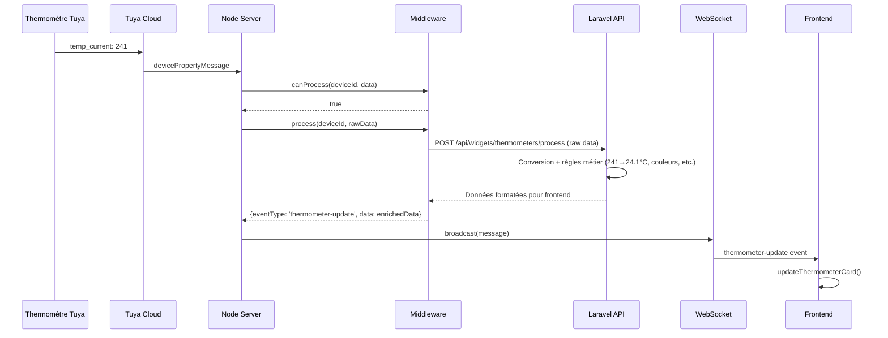

# Architecture Temps Réel HomeHub

## 🏗️ Vue d'ensemble

HomeHub utilise une architecture temps réel à 3 couches pour traiter les événements IoT de manière optimisée pour les appareils legacy (iOS 9, Android 6) :

**Architecture générale :**

```
Tuya Cloud     →    Node.js Server    →    Frontend
(Pulsar API)        (Middlewares)          (WebSocket)
                            ↕
                        Laravel API
                        (Règles métier)
```

**Flux de données :**
1. **Tuya Cloud** → Événements IoT via Pulsar WebSocket
2. **Node.js** → Traitement par middlewares
3. **Laravel API** → Enrichissement avec règles métier
4. **WebSocket** → Diffusion temps réel vers navigateurs legacy

## 🔌 1. Connexion Tuya Message Queue

### SDK Officiel Tuya
Le serveur Node.js utilise le **SDK officiel Tuya Pulsar** pour recevoir les événements en temps réel.


### Contrainte Legacy
Les navigateurs iOS 9/Android 6 ne supportent pas :
- ❌ WebSocket Secure (WSS) moderne
- ❌ EventSource (Server-Sent Events)
- ❌ Fetch API avancée

➡️ **Solution proposé** : Node.js fait le pont entre Tuya (WSS moderne) et le frontend (WebSocket simple)

## ⚙️ 2. Système de Middlewares

### Architecture Modulaire
Chaque widget peut définir son propre middleware pour traiter les données :

```
app/Widgets/MonWidget/
└── node-plugin/
    ├── config.json      # Configuration du middleware
    └── middleware.js    # Logique de traitement
```

### Workflow de Traitement
```javascript
// 1. Réception événement Tuya
tuyaClient.on('device-event', async (deviceEvent) => {
  // 2. PluginManager trouve le bon middleware
  for (const plugin of middlewares) {
    if (plugin.canProcess(deviceEvent.deviceId, deviceEvent.data)) {
      // 3. Le middleware traite
      const result = await plugin.process(deviceEvent.deviceId, deviceEvent.data);
      
      // 4. Diffusion des données enrichies
      wsServer.broadcast({
        type: result.eventType,
        deviceId: deviceEvent.deviceId,
        data: result.data
      });
      break;
    }
  }
});
```

### Exemple : Middleware Thermomètres

```javascript
class ThermometersMiddleware {
  // Filtre : seuls les thermomètres configurés
  canProcess(deviceId, data) {
    return this.deviceIds.includes(deviceId) && 
           (data.temp_current !== undefined || data.humidity_value !== undefined);
  }

  // Traitement : le middleware gère la conversion et l'enrichissement
  async process(deviceId, rawData) {
    // Le middleware envoie la raw data à Laravel pour traitement
    const enrichedData = await this.callPhpApi(deviceId, rawData);
    
    // Laravel retourne les données formatées pour le frontend :
    // - Température convertie (241 → 24.1°C)
    // - Couleurs calculées selon les seuils
    // - État de batterie formaté
    // - Emoji thermique selon la température
    //...

    // Retour formaté pour WebSocket
    return {
      eventType: 'thermometer-update',
      data: enrichedData // Données prêtes pour le frontend
    };
  }
}
```

### Avantages des Middlewares

1. **Performance** : Filtrage côté serveur → moins de trafic WebSocket
2. **Validation** : Données nettoyées avant envoi au frontend
3. **Extensibilité** : Ajout de nouveaux widgets sans modification du core
4. **Règles métier** : Enrichissement via Laravel API (calculs, seuils, alertes)

## 🔄 3. WebSocket Temps Réel

### Serveur WebSocket Local
```javascript
// websocket-server.js
const wsServer = new WebSocketServer({
  host: '0.0.0.0',
  port: 3001
});

// Diffusion vers tous les clients connectés
wsServer.broadcast({
  type: 'thermometer-update',
  deviceId: 'abc123',
  timestamp: Date.now(),
  data: { temperature: 24.1, humidity: 65, ... }
});
```

### Client Frontend
```javascript
const ws = new WebSocket('ws://0.0.0.0:3001');

ws.onmessage = function(event) {
  const message = JSON.parse(event.data);
  
  // Routage par type d'événement
  switch(message.type) {   
    case 'thermometer-update':
      updateThermometerCard(message.deviceId, message.data);
      break;
    case 'light-state-changed':
      updateLightSwitch(message.deviceId, message.data);
      break;
    ...
  }
};
```

## 🎯 4. Flux de Données Complet

### Exemple : Changement de Température



## 🔧 5. Configuration

### Variables d'Environnement
```env
# node-realtime/.env
TUYA_CLIENT_ID=your_client_id
TUYA_CLIENT_SECRET=your_secret
TUYA_REGION=EU

WS_HOST=0.0.0.0
WS_PORT=3001
APP_URL=http://localhost:8000

DEBUG=true
```

### Démarrage
```bash
# Node.js Realtime
cd node-realtime
npm start
```

## 📊 6. Monitoring et Debug

### Logs Structurés
```
🔍 [TUYA-CLIENT] MESSAGE RECEIVED - bizCode: devicePropertyMessage
🎯 Device event received:
   Device: bfdb6ddbf1877a9d68q3jb
   Properties: 3 changes
   [1] temp_current: 241
   [2] humidity_value: 60
   [3] battery_percentage: 55
📡 Sent to 2 clients: thermometer-update
```

### Gestion d'Erreurs
- **Reconnexion Tuya** : Automatique avec backoff exponentiel  
- **Middleware Crash** : Isolation par plugin
- **WebSocket Disconnect** : Reconnexion côté client
- **Laravel API Down** : Fallback et retry

## 🎨 7. Optimisations Legacy

### Mémoire
- **Batch Processing** : Regroupement d'événements
- **Event Debouncing** : Éviter le spam d'updates

### Compatibilité Réseau
- **WebSocket Simple** : Pas de compression ni extensions
- **JSON Compact** : Propriétés courtes

Cette architecture garantit des mises à jour temps réel fluides même sur du matériel de 2015, tout en conservant une extensibilité moderne via le système de middlewares.
